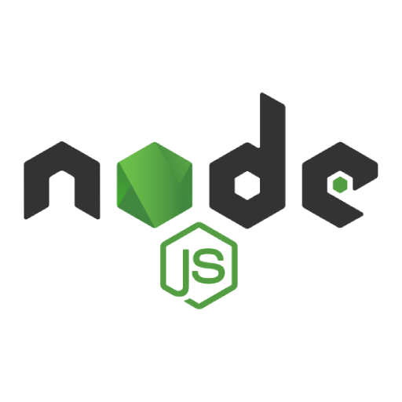
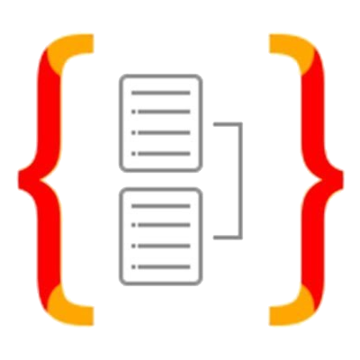

# Hey there! 

My name is <b>Maxime Laplace</b>, I am a French Software Engineer based in Paris.  
After finishing my Master of General Engineering at [CentraleSupélec](https://www.centralesupelec.fr), I now work as a Software Engineer at [Datadog](https://www.datadoghq.com/)

I love working on ambitious projects, and I am trying my best to apply my skills for the greater good.

<!--
 

<code></code>
<code></code> 
  <i>My languages</i>

---

# My tech stack 

### Frontend development

<code></code>
<code></code>
<code></code>
<code></code>
<code></code>
<code></code>
<code></code>
<code></code>
<code></code>
--
### Backend development

<code></code>
<code></code>
<code></code>
<code></code>
<code></code>
--

### Databases

<code></code>
<code></code>
<code></code>
<code></code>
<code></code>
<code></code>
--

### DevOps
<code></code>
<code></code>
<code></code>
<code></code>
<code></code>
<code></code>
